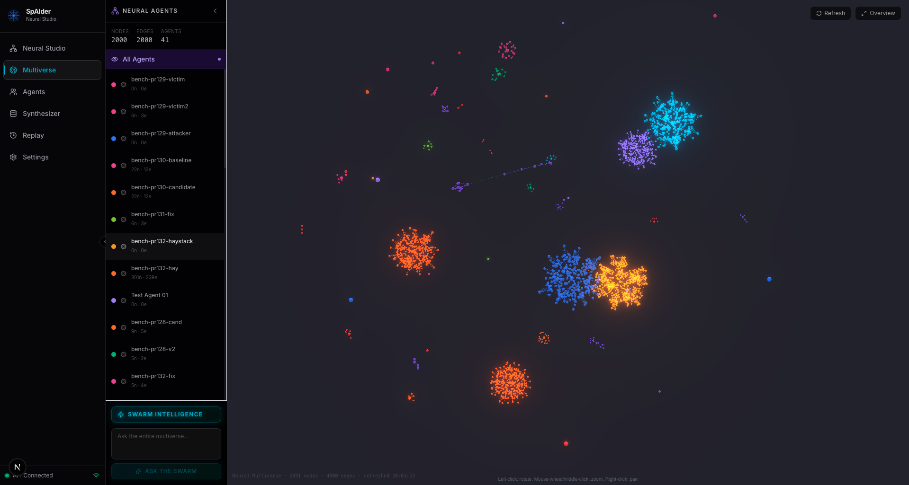

# SpAIder: Memory Infrastructure for AI Agents

<p align="center">
  <a href="https://github.com/Spaider-studio/spaider/stargazers"></a>
  <a href="https://github.com/Spaider-studio/spaider/actions/workflows/ci.yml"></a>
  
  
  <a href="benchmarks/COMPARISON.md"></a>
</p>

<p align="center">
  
  <br>
  <sub><i>The Neural Multiverse. Each cluster is one agent's knowledge graph, entities and relations laid out live.</i></sub>
</p>

SpAIder gives every AI agent a persistent, queryable knowledge graph. Agents ingest unstructured text, SpAIder extracts structured knowledge, and answers are grounded in a live graph of entities and relationships rather than raw document retrieval. **MCP-native**: drop into Claude Code, Cursor, or any MCP client with one command. No SDK, no glue code.

<p align="center">
  <b>97% accurate on data the model has never seen, at one flat cost that doesn't grow with your knowledge base.</b>
</p>

> **Phase 1 is self-hosted only.** Run your own instance via the Quickstart below; `spaider init` provisions an agent and issues your first API key. A managed hosted service is on the roadmap but not yet open for signup.

---

## The 5 Pillars

| Pillar | Description |
|---|---|
| **Ingest** | Stream raw text through Kafka; the SemanticCompressor (LLM) extracts nodes and edges |
| **Resolve** | The EntityResolver deduplicates via embedding cosine similarity, so no redundant facts |
| **Store** | Neo4j graph database with APOC; every node and edge is agent-namespaced |
| **Query** | Semantic search retrieves the relevant subgraph; an LLM generates a grounded answer |
| **Connect** | The ConnectorScheduler pulls from external sources (web, files, APIs) on a configurable schedule |

---

## Benchmarks

Benchmarked on **24 HotpotQA** multi-hop questions + a **16-question private corpus**, scored on EM / F1 / GEval (LLM-judge), **8 sweeps**, **95% CIs cluster-bootstrapped over the distinct questions** (not the graded rows), with an **independent gpt-4o judge**.

### Accuracy: the value is the memory, not the model

| Metric | HotpotQA (*public, the LLM memorized it*) | AcmeAI (*private, the LLM can't know it*) |
|--------|---|---|
| **GEval** (gpt-4o judge) | 0.43 → 0.77 (**+0.34**) ✅ | **0.00 → 0.97 (+0.97)** ✅ |
| F1 | 0.09 → 0.70 (**+0.61**) ✅ | 0.00 → 0.78 (**+0.78**) ✅ |
| Exact Match | 0.00 → 0.52 (**+0.52**) ✅ | 0.00 → 0.72 (**+0.72**) ✅ |

*vanilla (gpt-4o-mini alone) → with-SpAIder. ✅ = lift's 95% CI excludes 0.*

<sub>Re-validated against the current code (2026-06): across 6 fresh sweeps, F1 and Exact-Match reproduce within their 95% CIs, GEval reproduces for HotpotQA (0.72 [0.65, 0.79]), and AcmeAI GEval is corroborated by its 0.70 exact-match rate (a hard floor for GEval).</sub>

On **private data the LLM has never seen**, the bare LLM scores **0.00 on every metric** and SpAIder lifts semantic correctness to **0.97**. That is the entire value of the memory. Even on public trivia the LLM already half-knows, grounding the answer in retrieved facts still lifts it markedly (0.43 → 0.77).

<sub>**Head-to-head:** on identical corpora, questions and an independent gpt-4o judge, SpAIder is **statistically tied with Mem0 and Cognee** — every system-vs-system difference falls within its 95% CI — while all three beat a bare model by a wide margin on private data. Full reproducible table (3 corpora, both retrieval-isolated and native modes): [benchmarks/COMPARISON_SYSTEMS.md](benchmarks/COMPARISON_SYSTEMS.md).</sub>

### Cost: flat as your knowledge base grows

Getting from **0.00 to 0.97** means grounding the answer in your data. The brute-force way, pasting your entire knowledge base into every prompt (*context-stuffing*), reaches the same accuracy, but its cost grows with every fact you add and eventually hits a hard wall. SpAIder retrieves only the relevant slice, so it **matches that accuracy at a flat, corpus-independent cost**.

<p align="center">
  
  <br>
  <sub><i>Your data can be a library. SpAIder reads only the chapter that matters, and answers like it read everything.</i></sub>
</p>

- **SpAIder:** ~flat **$0.002 / query** at any corpus size (it sends a bounded retrieved slice, not the whole corpus).
- **Context-stuffing:** cost climbs linearly, **crosses SpAIder at ~15k tokens** (roughly a 30-page document), and above **~30k tokens** the request is rejected outright by the model's token limits. SpAIder is unaffected.

So on a private knowledge base of any real size, SpAIder is both **more accurate than the model alone** (0.97 vs 0.00) **and cheaper than stuffing the corpus**, and it keeps working where context-stuffing cannot.

→ Full results: **[benchmarks/COMPARISON.md](benchmarks/COMPARISON.md)** · per-corpus [HotpotQA](benchmarks/scorecard_hotpotqa.md) / [AcmeAI](benchmarks/scorecard_acmeai.md) · token economics + methodology: **[docs/token-economics.md](docs/token-economics.md)** · reproduce with `make bench-scorecard`.

---

## Architecture

```
                          ┌─────────────────────────────────────────┐
                          │              Kong Gateway :8080          │
                          │   rate-limiting · CORS · routing         │
                          └────────────────┬────────────────────────┘
                                           │
                          ┌────────────────▼────────────────────────┐
                          │           FastAPI Backend :8000          │
                          │  /ingest  /query  /graph  /synthesize   │
                          │  /agents  /connectors  /swarm           │
                          └──┬───────────────┬──────────────┬───────┘
                             │               │              │
               ┌─────────────▼──┐   ┌────────▼──────┐  ┌───▼────────┐
               │  Kafka :9092   │   │  Neo4j :7687  │  │ Redis :6379│
               │  spaider.ingest│   │  Graph Store  │  │  Cache /   │
               │  .raw topic    │   │  + APOC + FTS │  │  Sessions  │
               └────────┬───────┘   └───────────────┘  └────────────┘
                        │
               ┌────────▼───────────────────┐   ┌─────────────────────────────┐
               │  backend-worker (x N)       │   │  PostgreSQL :5432           │
               │  SemanticCompressor (LLM)   │   │  Connector state +          │
               │  EntityResolver (embeddings)│   │  credentials (AES-256-GCM)  │
               │  ConnectorScheduler         │   └─────────────────────────────┘
               └─────────────────────────────┘   ┌─────────────────────────────┐
                                                  │  Next.js Frontend :3000     │
                                                  │  3D Force Graph (WebGL)     │
                                                  └─────────────────────────────┘
```

ClickHouse (:8123) stores analytics and audit logs. See [docs/operations.md](docs/operations.md) for the full service table and scaling.

---

## Quickstart

```bash
git clone https://github.com/Spaider-studio/spaider.git
cd spaider
pip install -e ./cli         # or pipx install ./cli (recommended)
spaider init                 # interactive setup wizard (work in progress)
```

That's the whole flow. `spaider init` checks Docker, prompts for your LLM provider (OpenAI / Anthropic / Ollama) and validates the key, generates the JWT/connector/Neo4j secrets, writes `.env`, brings up `backend-api`, provisions a personal `dev-<USER>` agent, and writes `~/.claude/.mcp.json` + `~/.claude/skills/spaider.md` so Claude Code reflexively reaches for SpAIder. Restart Claude Code and you're done. (Re-running is safe: existing secrets are preserved.)

Run `spaider doctor` any time for a read-only audit of the install.

**Prefer prebuilt images?** Skip the source build — pull the published containers and run the stack:

```bash
git clone https://github.com/Spaider-studio/spaider.git && cd spaider
cp .env.example .env          # set LLM_API_KEY (or leave empty for Ollama)
docker compose pull           # fetch ghcr.io/spaider-studio/spaider-* images
docker compose up -d          # pin a release with SPAIDER_VERSION=0.1.0
```

The default compose builds the app images from source (`docker compose up --build`); the lines above pull the prebuilt images from GHCR instead.

<details>
<summary><b>Manual install</b> (advanced)</summary>

```bash
git clone https://github.com/Spaider-studio/spaider.git
cd spaider
make setup                   # copies .env.example → .env
```

Edit `.env` and fill in your secrets:

```bash
LLM_API_KEY=sk-your-key-here
NEO4J_PASSWORD=choose-a-strong-password
JWT_SECRET=$(python -c "import secrets; print(secrets.token_hex(32))")
CONNECTOR_SECRET_KEY=$(python -c "import secrets,base64; print(base64.b64encode(secrets.token_bytes(32)).decode())")
```

Bring up the stack and wire MCP by hand:

```bash
make dev          # development with hot reload   (make prod for production)
scripts/dev/setup_mcp_dev_agent.sh
# copy the printed JSON block into ~/.claude/.mcp.json under mcpServers
```

(`spaider init` does all of the above in one command.)

</details>

---

## Use SpAIder in Claude Code

Once `spaider init` completes:

1. Restart Claude Code so it picks up `~/.claude/.mcp.json` and the new `~/.claude/skills/spaider.md` skill.
2. In a fresh session, ask Claude *"what do you remember about this project?"*. It should reach for `spaider.list_recent` and `spaider.query` on its own.
3. Capture non-obvious learnings via `spaider.ingest_fact`. The skill file documents when each tool is appropriate, the feedback protocol (`spaider.feedback`), and how to fail gracefully when the backend is down.

The skill file is the high-leverage half. Without it Claude Code sees `spaider.*` as just-another-tool; with it the LLM has explicit triggers for when to use each one. Source: [`cli/src/spaider_cli/skills/claude_code.md`](cli/src/spaider_cli/skills/claude_code.md), free to copy and adapt for other AI tools.

---

## Python SDK

```bash
pip install spaider-client
```

```python
from spaider import Spaider

sp = Spaider(api_key="sk-...", agent_id="my-agent")
sp.ingest("Max Mustermann arbeitet bei Google.")
answer = sp.query("Wo arbeitet Max?")
print(answer.text, answer.subgraph.nodes)

# Fine-tuning dataset export
sp.synthesize(strategy="reasoning", max_samples=1000).save("training.jsonl")
```

An async client (`AsyncSpaider`) and **LangChain** / **LlamaIndex** memory adapters ship in the same package. See [`sdk/python/README.md`](sdk/python/README.md) for full SDK documentation.

---

## Documentation

| Topic | |
|---|---|
| **[API reference](docs/api.md)** | All REST endpoints, auth, connectors, MCP, swarm |
| **[Operations](docs/operations.md)** | Docker services, scaling, embedding providers, graph maintenance |
| **[Repository structure](docs/repository-structure.md)** | Project layout + `make` targets |
| **[Developer guide](docs/developer-guide.md)** | Stigmergic swarm internals (Redis Streams) |
| **[Training-data export](docs/finetuning-export.md)** | Export your graph as SFT/DPO fine-tuning data (UI, REST, CLI) |
| **[Token economics](docs/token-economics.md)** | Is SpAIder cheaper than context-stuffing or a bare LLM? Measuring the grounding cost |

---

## Contributing

Fork, branch, make your changes, then `make test && make lint` (both must pass) and open a PR against `main`. All contributors sign a one-click CLA on their first PR (via [CLA Assistant](https://cla-assistant.io/)). See [CONTRIBUTING.md](CONTRIBUTING.md) for details and commit style.

---

## License

SpAIder is split-licensed:

- **Core**: the backend server and frontend are **GNU AGPL-3.0** ([LICENSE](LICENSE)). Self-host freely; if you run a modified version as a network service, the AGPL requires you to offer your modifications under the same license.
- **Client tooling**: the CLI ([`cli/`](cli/LICENSE)) and Python SDK ([`sdk/python/`](sdk/python/LICENSE)) are **Apache-2.0**, so you can embed them in any application without copyleft obligations.
- **Commercial license**: the AGPL's copyleft (publish the source of any modified network service you run) is a blocker for some organisations, e.g. embedding SpAIder in a closed-source product, or running a private modified instance without releasing the changes. A commercial license grants the right to use SpAIder under different terms. **You run your own deployment**; this licenses the software, it is not a hosted/managed service. Contact **contact@spaider.studio**.

Contributions are accepted under the CLA, which is what lets us offer the commercial license above.

## Security

Security issues: please email **security@spaider.studio** rather than opening a public issue. See [SECURITY.md](SECURITY.md) for the full policy.
