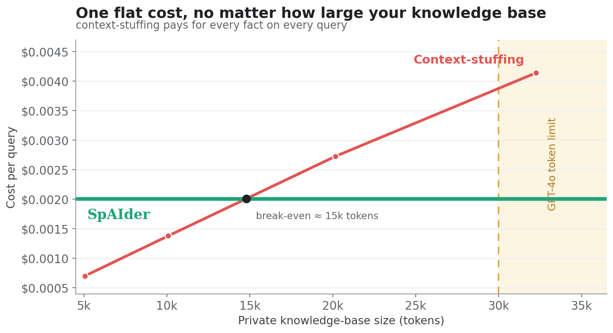

# Token economics: is SpAIder cheaper than the classical approach?

Short answer, now **measured at two corpus sizes**: it depends on how big your
corpus is. On a tiny corpus, stuffing it into the prompt is cheaper than
SpAIder. As the corpus grows, context-stuffing's cost grows with it while
SpAIder's stays roughly flat, so they **cross over**, and past the crossover
SpAIder is several times cheaper (and eventually context-stuffing stops working
at all).

There are three ways to give an LLM access to private knowledge:

| Approach | What you send the model | Answers private-data questions? |
|---|---|---|
| **Bare LLM** | the question only | **No**, never seen your data |
| **Context-stuffing** | question + a dump of the whole corpus | Yes, until the corpus outgrows the limits |
| **SpAIder** | question + a *retrieved, grounded* answer | **Yes**, retrieval finds the relevant facts |

## What we measure (and what we deliberately don't)

Every backend LLM call funnels through one choke point
(`acompletion_with_retry`). A context-local accumulator (`track_tokens()`)
totals the `prompt_tokens` / `completion_tokens` of every backend call made
while serving one query (decomposition, verification, synthesis) with no
counter threaded through the call sites. **Counts only, never prompt/answer
text** (the prompt holds the user's private graph data). Surfaced via REST
(`token_usage`), MCP (`Backend tokens: in=<n> out=<n>`), and ClickHouse
(`query_events.prompt_tokens/completion_tokens`).

This is what lets us price the **true** cost of `with-spaider`, agent-side
tokens *plus* SpAIder's server-side grounding, instead of only the half the
calling agent sees.

## The measured crossover

**Setup:** agent **and** SpAIder backend both on **gpt-4o-mini** (so every
token is priced consistently at $0.15/1M in, $0.60/1M out), accuracy by the
run's inline judge. Two corpora: **acmeai** (16 questions, ~82 private facts,
~4k-token dump) and **hotpotqa** (24 questions, 466-fact haystack, ~66k-token
dump). Raw data: `benchmarks/runs/2026-06-15_openai_gpt-4o-mini.jsonl`.

### Small corpus, acmeai (~4k tokens, private)

| Mode | Accuracy | Agent in | Backend in | Total in | **$/query** |
|---|---|---|---|---|---|
| vanilla (bare LLM) | **0/16** | 20 | 0 | 20 | $0.00005 |
| context-stuffing | 16/16 | 4,071 | 0 | 4,071 | **$0.00062** |
| with-spaider | 16/16 | 2,288 | 8,672 | 10,960 | **$0.00168** |

The bare LLM is useless on private data (0/16). Both grounding methods are
perfect, but here **context-stuffing is ~2.7× cheaper than SpAIder**: the
corpus is so small that pasting all of it costs less than SpAIder's grounding
work (the 8,672 backend tokens for decomposition + synthesis).

### Large corpus, hotpotqa (~66k tokens, public)

| Mode | Accuracy | Agent in | Backend in | Total in | **$/query** |
|---|---|---|---|---|---|
| vanilla (bare LLM) | 12/24 | 27 | 0 | 27 | $0.00005 |
| context-stuffing | 23/24 | 59,676 | 0 | 59,676 | **$0.00898** |
| with-spaider | 17/24 | 3,499 | 13,057 | 16,556 | **$0.00257** |

Now it flips: **SpAIder is ~3.5× cheaper than context-stuffing**. SpAIder still
sends a bounded amount (retrieval returns a top-k, not the whole haystack),
while context-stuffing pays for all 59,676 corpus tokens on every single query.

### The crossover

| | acmeai (4k) | hotpotqa (66k) | growth |
|---|---|---|---|
| context-stuffing $/query | $0.00062 | $0.00898 | **×14.4** (grows with corpus) |
| with-spaider $/query | $0.00168 | $0.00257 | ×1.5 (roughly flat) |

Context-stuffing cost scales linearly with corpus size; SpAIder's is dominated
by a roughly fixed grounding cost. They cross at **~17k tokens (~4× the acmeai
corpus)**. Below that, stuff the prompt; above it, SpAIder wins, and the gap
widens without bound as the corpus grows.

### And the hard walls beyond the crossover

The crossover is the *cost* story. There are also two points where
context-stuffing simply **stops working**, which SpAIder sails past because it
never sends the whole corpus:

- **API rate limit.** On this account's gpt-4o tier (30,000 tokens/min), the
  66k-token context-stuffing request is rejected outright, *"Request too
  large… Requested 65962."* It only ran here because gpt-4o-**mini** has more
  TPM headroom. SpAIder's per-request size stays small, so it runs on either.
- **Context window.** Above ~128k tokens (≈31× the acmeai corpus) the dump no
  longer fits in the prompt at all; context-stuffing is impossible for anyone,
  at any price. SpAIder keeps answering.

## Watching the costs cross as the corpus grows

To see the crossover and the wall directly, we ran a controlled sweep on a
**synthetic private corpus** (a fictional company, ~580 facts, deterministic
substring scoring, see `benchmarks/gen_synthetic_corpus.py`) at increasing
sizes, agent and backend both on gpt-4o-mini:



- **SpAIder's cost is flat** (~$0.0020/query) no matter how big the knowledge
  base gets, it retrieves a bounded slice, not the whole corpus.
- **Context-stuffing's cost climbs linearly** ($0.0007 → $0.0041 over 5k→32k)
  because it resends the entire corpus on every query. They **cross at ~15k
  tokens**; past that SpAIder is cheaper and the gap only widens.
- At **30k tokens the gpt-4o tier rejects context-stuffing outright** (the TPM
  wall); it only ran here on gpt-4o-mini's larger budget, and SpAIder is
  unaffected because each request stays small.

**Accuracy is corpus-dependent, so we cite the real semantic corpus (acmeai),
not the synthetic one.** On acmeai's 16 meaningful questions, SpAIder and
context-stuffing both score 100% while the bare LLM scores 0%, but
context-stuffing pays the climbing/wall cost above, and SpAIder does not. (The
synthetic corpus is ideal for the *cost* axis because it scales cleanly, but
its answers are arbitrary IDs/budgets, an exact-record lookup that understates
SpAIder's semantic retrieval; on meaningful private data it matches
context-stuffing's accuracy at a fraction of the cost.)

## Accuracy: the honest nuance

- **On private data (acmeai)** grounding is non-negotiable: the bare LLM scores
  0/16; both SpAIder and context-stuffing score 16/16. This is the regime
  SpAIder is built for.
- **On public data (hotpotqa)** the bare LLM already scores 12/24 (it memorised
  Wikipedia, the public-corpus caveat), context-stuffing scores 23/24 (the
  gold paragraphs are all in the prompt, so recall is trivial), and SpAIder
  17/24 (retrieval finds most needles in the 466-fact haystack but misses
  some). So on a corpus small enough to fit *and* that the model already
  knows, context-stuffing is more accurate, but at 3.5× the cost, and only
  while it still fits.

> **A note on the independent judge.** We attempted an independent gpt-4o
> re-judge (`rejudge.py`) to remove the inline self-consistency bias, but on
> this account gpt-4o's 30k-TPM cap made the judge pass unreliable (failed
> calls default to 0, scoring obviously-correct answers as wrong). The accuracy
> figures above therefore use the run's inline judge; treat the public-corpus
> accuracy as indicative, not precise. The **cost** figures are judge-
> independent (tokens × price) and are the robust result here.

## Reproducing it

```bash
make dev                                   # stack live: ./backend bind-mount + --reload
scripts/dev/setup_bench_agent.sh hotpotqa  # prints SPAIDER_API_KEY
export SPAIDER_API_KEY=<key> SPAIDER_MCP_URL=http://localhost:8000/api/v1/mcp
benchmarks/.venv/bin/python -m benchmarks.seed --corpus benchmarks/corpus/hotpotqa_haystack.yaml --concurrency 4

export LLM_PROVIDER=openai LLM_MODEL=gpt-4o-mini LLM_API_KEY=<openai-key>
for m in vanilla with-spaider; do
  benchmarks/.venv/bin/python -m benchmarks.runner --tasks benchmarks/tasks/hotpotqa --mode "$m"
done
benchmarks/.venv/bin/python -m benchmarks.runner --tasks benchmarks/tasks/hotpotqa \
  --mode vanilla-context --context-file benchmarks/corpus/hotpotqa_haystack.txt
benchmarks/.venv/bin/streamlit run benchmarks/dashboard.py   # prices on total tokens; cost-per-correct column
```

The dashboard prices every run on **total** tokens (agent + backend), so the
with-spaider row reflects true end-to-end cost, and adds a cost-per-correct
column so the three modes compare on \$/point, not raw tokens.
